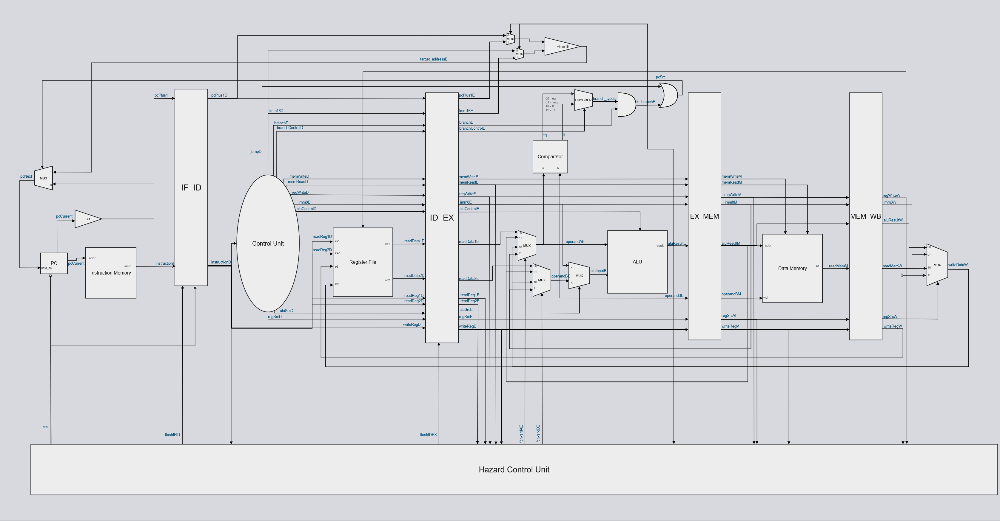

# 8-bit-Microprocessor

---
## Instruction Set Architecture

| Opcode | Mnemonic | Type |
|--------|----------|------|
| 0000   | ADD      | R    |
| 0000   | SUB      | R    |
| 0000   | AND      | R    |
| 0000   | XOR      | R    |
| 0000   | NOT      | R    |
| 0000   | ADDU     | R    |
| 0000   | SUBU     | R    |
| 0001   | SLL      | R    |
| 0001   | SRL      | R    |
| 0001   | SRA      | R    |
| 0001   | ROL      | R    |
| 0001   | ROR      | R    |
| 0010   | ADDI     | I    |
| 0011   | LI       | LI   |
| 0100   | LOAD     | M    |
| 0101   | STORE    | M    |
| 0110   | BEQ      | B    |
| 0111   | BNE      | B    |
| 1000   | BLT      | B    |
| 1001   | BGE      | B    |
| 1010   | JMP      | J    |
| 1111   | NOP      | —    |

---

## Pipelined

The processor is a classic 5-stage pipeline – IF, ID, EX, MEM, WB – built around an 8-bit
datapath (register file, ALU, and data memory are all 8 bits wide) driven by a 16-bit instruction
word and a 16-bit program counter.   

Components include:
- ALU
- Comparator
- Control-Unit
- Program Counter
- Instruction Memory
- Data Memory
- Register File
- Pipeline Registers
- Hazard Unit

